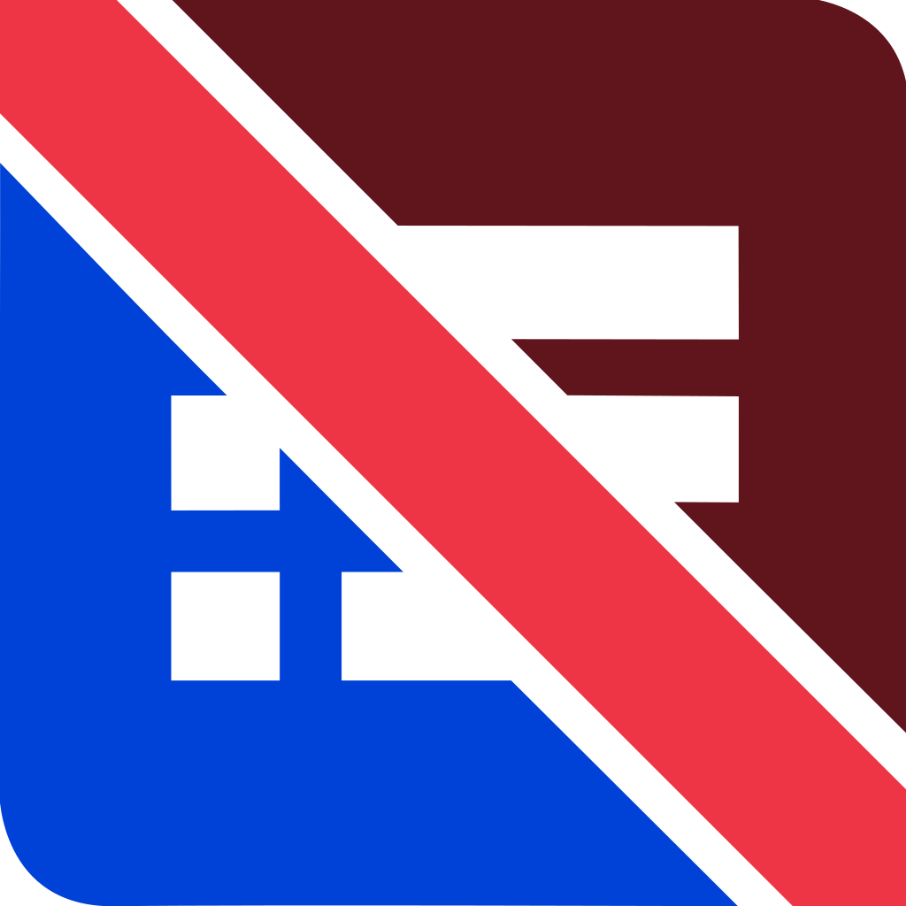

   

   <h1> NFFU </h1>

> no form for u -- automate your TDSB async attendance

Created by @mincrmatt12 and @tylertian123.

## What is it?

Do you hate waking up just to fill in a silly form before going back to sleep; thus defeating the purpose of said form? Do you wish there was some way to automate this process? If you answered YES to
any of these questions NFFU might just be for you!

NFFU is a fully-featured system for automating your TDSB asynchronous attendance. We do everything automagically, from checking your timetable from the TDSB Connects App to filling in and submitting the correct
form.

## How do I use it?

If you're at BCI you can ask either of the authors and we'll send you a link to our hosted instance, but if you either don't trust us or otherwise need your own instance, follow the instructions in the [deployment guide](docs/deployment.md) to get
one running.
